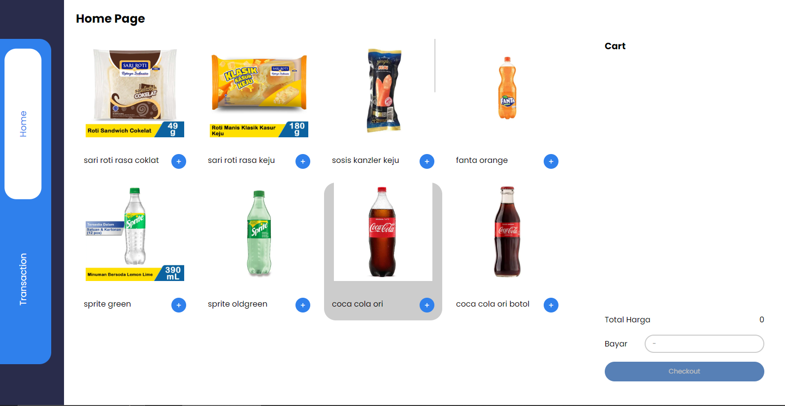
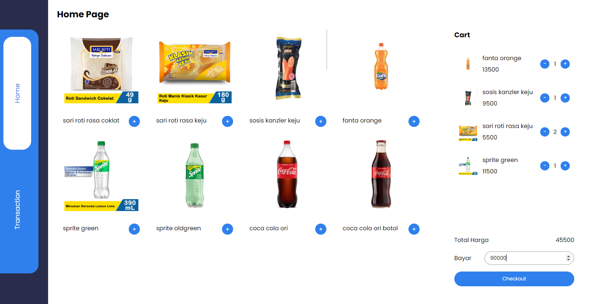
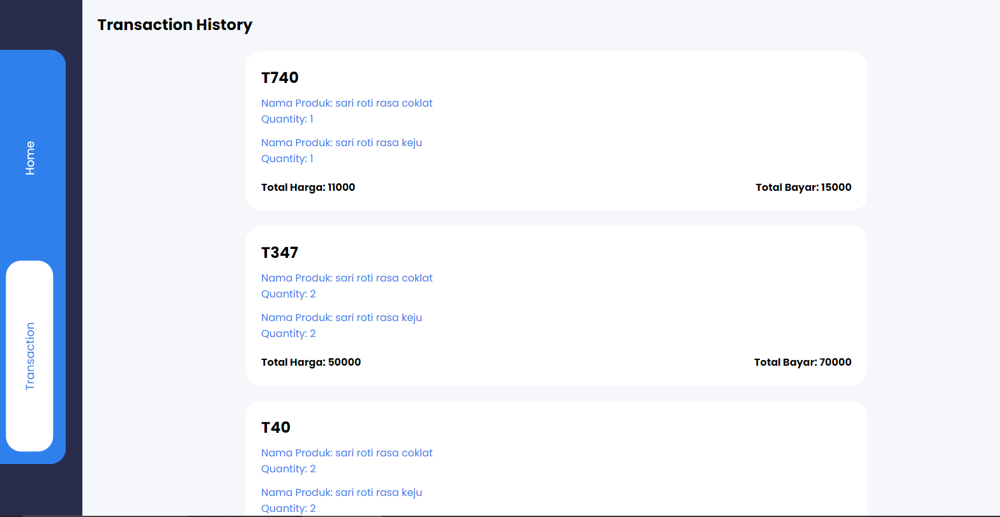
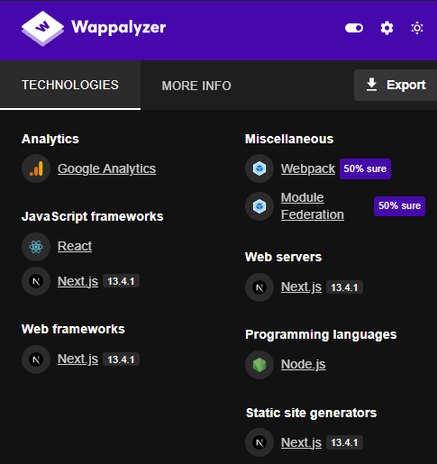

# Point Of Sale Web App

 

 

## :pencil: Prerequisites
- node js (minimum version v16.8)
- xampp or laragon
- npm package installer

## :hammer: Tech Stack 
- Next.js for the Javascript framework
- Vanila CSS for styling
- SQL for database

## :loudspeaker: Note
1. This web app is still a work in progress for me, with ongoing updates planned for both its features and technology stack. I'll be making regular updates on both fronts.
2. Back Office system are in development stage.
3. This is my first fullstack program so feel free if you guys have any suggestions or criticisms. I really appreciate it.